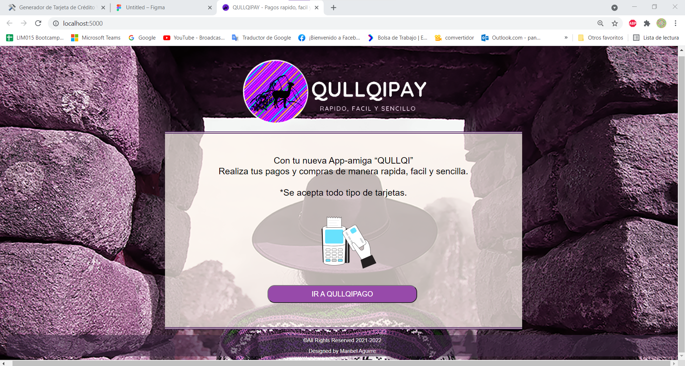

# QULLQIPAY - Rapido, fácil y sencillo

## Índice

* [1. Resumen del proyecto](#1-resumen-del-proyecto)
* [2. Prototipo final](#2-prototipo-final)
* [3. Investigación](#1-investigación)
* [4. Objetivos de aprendizaje](#3-objetivos-de-aprendizaje)

***

## 1. Resumen del Proyecto

QULLQIPAY, es una aplicación que valida, registra y realiza operaciones con las diferentes Franquicias que tiene las tarjetas.

## 2. Proyecto final

## 3. Investigación

 * ## Usuario
    Diseñado para los usuarios que tienen diferentes tipos de tarjeta y franquicias como visa, mastercard, etc.
 * ## Solucion de la problematica 
    Usiarios que deseen realizar operaciones en un solo lugar con diferentes tarjetas y franquicias como visa, mastercard, etc.
 * ## Prototipo en papel

    

 * ## Mejoras del Feedback
    Agregar un resumen del feedback recibido indicando las mejoras a realizar.
 * ## Prototipo final

    

    

    

## 4. Objetivos de aprendizaje
 * ## UX
      Entender y comprender la necesidad del usuario.

      Plasmar y diseñar una interfaz amigable, fácil y rapida de usar.

 * ## HTML Y CSS
      Comprender el significado de maquetización en HTML.

      Enteder el uso de algunos selectores y atributos del css para el diseño de la pagina.

  * ## DOM
      Aprender la manipulación dinamica del DOM, en este caso yo use el innerHTML para reescribir texto en un id o en una variable ya declarada.

      Entender y saber como implementar bien el manejo de eventos, en este caso use el addEventListener para que al momento de visualizar una acción como el click o presionar una tecla me haga ciertos insctrucciones

  * ## JAVASCRIPT
      Apreder como es la correcta declaración de la variable, como usar condiciones o bucles, como usar las funciones y que son los parametros. 

  * ## TESTING
      Aprender como realiza cada testing unitario y para que sirve.

  * ## ESTRUCTURA DEL CÓDIGO
      Aprender como estructurar cada paso o intruccion que realizo y a la vez que sea entendendible. Saber usar buenas practicas en la contruccion del codigo.

  * ## GIT Y GITHUB
      

